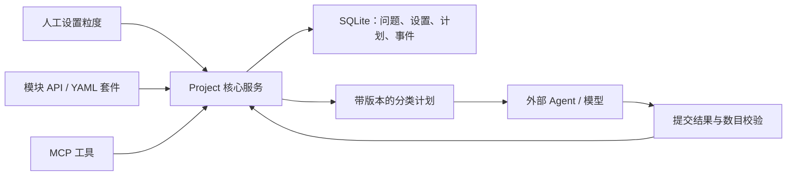

# AgentGranule 项目蓝图（v0.1）

## 目标与范围

以问题／子问题为作用域，记录人工对指定处理方向的粒度设置，并将该设置转化为 Agent 可执行的约束。首个方向为分类，参数为正整数 `count`。

本轮实现可运行的 Python 框架与独立接入分支。模型供应商、Web 界面、用户认证、云存储及通用方向插件留待后续需求。

## 架构

### 框架领域

- Session：一组项目交互的会话。
- Problem：属于会话的具体问题，可关联同会话的父问题。
- Control：问题上的分类列举数目；每次人工变更增加版本。
- Plan：冻结问题、方向、数目及设置版本的处理计划。
- Event：带顺序号与 UTC 时间的原文消息、问题创建、设置变更、计划和结果记录。

核心服务对状态变更及对应事件使用同一 SQLite 事务。对话正文原样存储，允许用户、助手、工具与系统角色。无更新或删除历史事件的公共 API；数据库本身仍可由本地持有者修改，不声称防篡改。

### 交互闭环

1. 创建会话，记录用户原文。
2. 建立 A 与子问题 B。
3. 人工指定 B 的分类数目及操作者标记。
4. 生成包含数目与版本的处理计划。
5. 外部 Agent 按计划处理，并将可见助手／工具消息回传记录。
6. 提交分类结果；校验列举数目并保存接受或拒绝记录。
7. 人工改动设置后旧计划失效，必须重新生成。

`actor` 是调用者提供的审计标记，不是身份认证。宿主负责确认人工来源与脱敏认证机密。当前系统只能记录传入的消息，不能自动取得外部聊天历史，也不记录隐藏思考。

## 接口契约

框架提供 `Project` 服务与 JSON 命令行入口；模块／YAML 与 MCP 共用该核心，不复制领域逻辑。YAML 分支通过白名单操作和命名引用执行套件，不允许动态导入或任意脚本。MCP 分支选择官方 Python SDK 的 v1 维护线并固定 `mcp>=1.28,<2`，通过 stdio 暴露工具。SDK 依据：[官方 v1 文档](https://py.sdk.modelcontextprotocol.io/v1/)。

## 验收

- B 的分类数目 3 能形成计划并接受 3 个分类；不接受其他数目。
- 修改为 5 后旧计划失效，历史设置及被拒结果仍可查询。
- 不同问题设置互不影响，父子问题不能跨会话关联。
- 原始对话与操作事件持久化后仍可读取。
- YAML 套件与 MCP 客户端分别跑通上述路径，错误输入有明确反馈。
- CI 在 Windows／Linux、Python 3.11／3.14 上运行适用分支的测试。

## 合并流程

见 [分支与人工审批](branch-workflow.md)。所有 PR 都等待人工决定；测试通过不等于审批通过。
