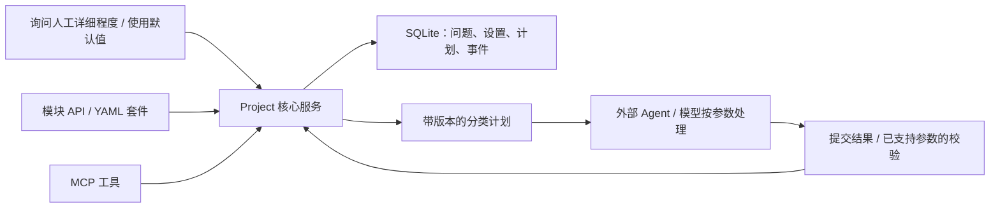

# AgentGranule 项目蓝图（v0.1）

## 目标与范围

**粒度是处理问题的详细程度。** 一个问题可以拆为多个模块，每个模块在不同处理方向上的处理力度可以不同。分类列举数目是这种抽象概念的一种具体参数，不是粒度的完整定义；A／子问题 B 也只是举例，不是固定任务结构。

框架用 `(模块, 处理方向, parameters)` 表示具体设置。`parameters` 可包含列举数目 `count`、详细程度 `detail_level`、展开深度 `max_depth` 或宿主使用的其他 JSON 参数。方向不限于分类，模块可独立建立或按需嵌套。

例如，分析某事件时可以有“优点”“缺点”“原因说明”模块：优点列举 2 项、缺点列举 5 项、原因做详细说明。也可以在同一模块下区分多个方向；这些粒度彼此独立。

本轮实现可运行的 Python 框架与独立接入分支。模型供应商、Web 界面、用户认证、云存储及通用方向插件留待后续需求。

## 架构

### 框架领域

- Session：一组项目交互的会话。
- Problem / Module：属于会话的问题或处理模块，可选父模块，无固定 A／B 结构。`add_module` 是表达该语义的入口，兼容已有 `add_problem`。
- Granularity：模块在一个处理方向上的详细程度参数对象，不是单个全局数值。
- Default：项目对某个方向的默认粒度；未配置时使用内置建议值。
- Control：`(module, direction)` 上的人工覆盖参数；每次变更增加版本。
- Plan：冻结模块、方向、参数、来源及版本的处理计划。
- Event：带顺序号与 UTC 时间的原文消息、问题创建、设置变更、计划和结果记录。

核心服务对状态变更及对应事件使用同一 SQLite 事务。对话正文原样存储，允许用户、助手、工具与系统角色。无更新或删除历史事件的公共 API；数据库本身仍可由本地持有者修改，不声称防篡改。

### 交互闭环

1. 创建会话，记录用户原文，按任务需要划分模块。
2. 调用 `request_granularity(module, direction)` 获取要呈现给用户的询问；列举方向询问数目，其他方向询问详细程度，并显示当前建议参数。
3. 宿主将问题呈现给用户，并记录真实交互。人工给出新设置时调用 `set_granularity`；选择使用默认值时不伪造人工覆盖。
4. 无覆盖时按项目默认 → 内置默认解析设置，`prepare_plan` 明确标记来源和 `uses_default`。允许直接使用默认值，不声称用户已回答。
5. 外部 Agent 按计划处理，并将可见助手／工具消息回传记录。
6. 提交 `output`，列举方向校验 `items` 数目，其余方向保存文本；接受或拒绝记录保留。
7. 修改当前使用的人工覆盖或默认值后旧计划失效；无关模块／方向的调整不影响该计划。

### 默认粒度与参数语义

- 内置建议：分类／列举／优点／缺点方向为 `count=3, detail_level=standard`；其他方向为 `detail_level=standard`。3 和 standard 是可修改的产品初始建议，不是用户指定值。
- `set_default_granularity(session_id, direction, parameters, actor)` 配置整个项目该方向的默认值，变更事件记录在指定会话；对其他会话同方向也生效。
- 优先级：模块人工覆盖 > 项目该方向默认 > 内置建议。设置对象整体替换，未填写字段不做隐式合并。
- `count` 和 `max_depth` 须为正整数，`detail_level` 为非空描述；其他参数须为有限 JSON 数据。
- 当前框架自动校验数目、版本与结果基本格式；详细程度、深度和宿主自定义参数作为执行约束传给外部 Agent，未实现语义质量判定。
- 原 count-only SQLite 数据自动迁移，消息与旧计划保留，`count`／`categories` 简写继续兼容。

`actor` 是调用者提供的审计标记，不是身份认证。宿主负责确认人工来源与脱敏认证机密。当前系统只能记录传入的消息，不能自动取得外部聊天历史，也不记录隐藏思考。

## 接口契约

框架提供 `Project` 服务与 JSON 命令行入口；模块／YAML 与 MCP 共用该核心，不复制领域逻辑。YAML 分支通过白名单操作和命名引用执行套件，不允许动态导入或任意脚本。MCP 分支选择官方 Python SDK 的 v1 维护线并固定 `mcp>=1.28,<2`，通过 stdio 暴露工具。SDK 依据：[官方 v1 文档](https://py.sdk.modelcontextprotocol.io/v1/)。

## 验收

- 独立模块可使用不同详细程度，同模块多个方向也互不影响。
- 列举数目可形成约束并拒绝错误数目；它仅是粒度参数之一。
- 默认值可配置、可持久化，无覆盖时生效；人工覆盖优先。
- 询问接口返回当前建议与来源，不伪造人工回答。
- 当前使用的设置改变后旧计划失效，历史设置及被拒结果仍可查询。
- 模块不能跨会话关联，旧 SQLite 消息与计划兼容迁移。
- 原始对话与操作事件持久化后仍可读取。
- YAML 套件与 MCP 客户端分别跑通上述路径，错误输入有明确反馈。
- CI 在 Windows／Linux、Python 3.11／3.14 上运行适用分支的测试。

## 合并流程

见 [分支与人工审批](branch-workflow.md)。所有 PR 都等待人工决定；测试通过不等于审批通过。
