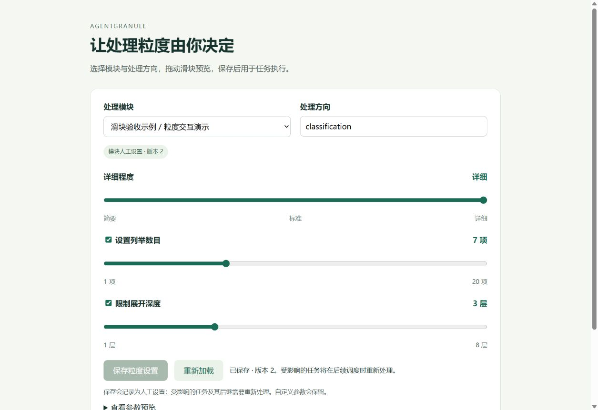

# 粒度滑块

用户已明确授权新增滑块界面，并更正为“分支”开发。本轮基于已由人工合并的 Skill/MCP main `c240b94`，分支 `codex/granularity-slider`；不创建其他仓库，不合并 PR。

## 启动

Python 3.11+，在项目根目录执行：

```sh
python -m pip install -e .
python -m agentgranule.slider --database .agentgranule/project.sqlite3 --port 8765
```

打开 `http://127.0.0.1:8765`。也可用安装后的 `agentgranule-slider` 命令。若需 MCP 和完整测试，安装 `python -m pip install -e ".[mcp]"`。本地服务仅监听 127.0.0.1，不自动启动模型处理。

1. 选择已有模块，或通过“创建新任务模块”新建任务与模块。
2. 选择或输入处理方向，例如 classification、advantages、explanation。
3. 调整详细程度滑块：简要 brief、标准 standard、详细 detailed。
4. 可启用列举数目和展开深度滑块；禁用会从参数中去掉对应约束。
5. 检查预览并点击“保存粒度设置”，写入该模块／方向的人工设置。

初始数目滑块为 1–20，深度为 1–8；已有值超出此范围时扩展上限，不截断。其他自定义参数保留，已有自定义 detail_level 在未拖动详细程度时保留。所有参数仍遵守核心服务非空对象约束；不能通过清空全部参数删除覆盖设置。

每次保存显示有效参数来源及版本；未保存的拖动仅影响预览。若其他入口已经修改该方向，旧页面保存返回 409，请重新加载后调整，避免覆盖新的人工选择。切换模块／方向期间不允许保存旧数据，响应较晚的加载不会覆盖新选择。

## 与算法、Skill、MCP 衔接

滑块与核心服务使用同一个数据库，保存调用与 Python/CLI/MCP 相同的粒度更新逻辑；操作者记录为 human:slider，参数、前值、版本及可见保存操作记录在事件库。没有将所有方向强制映射成分类数目。

保存后刷新当前会话的持久化工作流，使相关任务及后代失效；无关结果保留。宿主随后通过 next_task / submit_task 继续处理。AlgorithmRunner 会在下次运行时按相同设置重新检查缓存。保存仅修改粒度，不声称已完成语义重算或自动执行外部模型。

服务端只接受自己的 Host / Origin 和 JSON 写入，拒绝跨站请求。界面不提供远程访问或身份认证功能。已有的核心接口与数据库迁移继续可用。

## 验证

61 项测试通过，包括新增 8 项实际 HTTP 测试：资源及模块发现、保存／自定义参数保留／人工记录、过期版本拒绝、并发旧页面只有一次保存成功、非法数目不写入、跨站写入拒绝、新模块默认转覆盖、相关工作流失效及无关结果保留。

通过真实浏览器在独立 `.agentgranule/slider-preview.sqlite3` 验收数据库创建示例模块，键盘调到 detailed、count=5、max_depth=3，保存后刷新保留值；再用鼠标拖动 count=7，保存显示版本 2，数据库核验一致。这些是界面测试输入，不是用户对真实业务模块的粒度决定。


